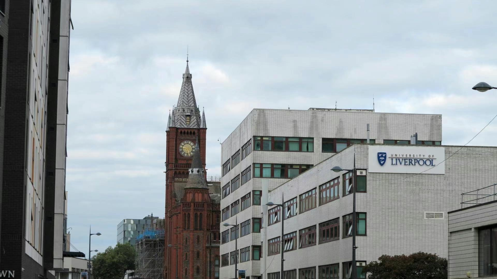

&nbsp;

&nbsp;

### Education
- **Columbia University Mailman School of Public Health** [New York, NY]{style="float:right"}  
  Master of Science (MS) Biostatistics, GPA: 4.05/4.33 [*Sept. 2021 – May. 2023*]{style="float:right"}
  - Related Courses: Probability, Biostatistical Methods I, Principles of Epidemiology, Statistical Inference, Statistical Computing with SAS, New drug development, Introduction to Clinical Trials, Clinical Trial Methodology, Survival Analysis, Data Science, Relational Databases and SQL Programming

&NewLine;

- **Xi'an Jiaotong-Liverpool University** [Suzhou, China]{style="float:right"}  
  Bachelor of Science (BS) Bioinformatics, GPA: 3.81/4.00 [*Sept. 2017 – Jul. 2021*]{style="float:right"}  
  - Awards: 2017/18, 2018/19, 2019/20 National Encouragement Scholarship
  - Related Courses: Calculus, Linear Algebra, Multivariable Calculus and Statistics, Method for Analyzing Public Health: Biostatistics, Bioinformatics, Artificial Intelligence, Machine Learning, Big Data Analytics, Database Development and Design
  
&nbsp;

### Academic Projects
- **Crime Rate Prediction in US Counties Using Multiple Linear Regression Model** [New York, NY]{style="float:right"}   
  Final Project of Biostatistics [*Dec. 2021*]{style="float:right"}    
  - Obtained an effective tool to predict the crime rate in US counties for future crime prevention.  
  - Pre-processed the data containing the characteristics of 440 US counties from 1990 to 1992 and employed exploratory data analysis to identify the correlation between predictors and crime rate.  
  - Explored several candidate multiple linear regression models for predicting the crime rate after the completion of statistical modelling, diagnosis, and validation.  

&NewLine;

- **Applying Technical Independent ML Models to Predict Single-based m6A Sites** [Suzhou, China]{style="float:right"}   
  Final Year Project [*Sept. 2020 – Jun. 2021*]{style="float:right"}    
  - Established a statistical framework for GC content bias correction in genomic machine learning models, namely correcting the common technical artifact in the inference step of the predictive model so that we can accurately predict the genomic markers.
  - Applied the classical smooth regression models to the inference values of machine learning algorithms on the validation set.
  - Performed exploratory data analysis (EDA) and decided if the GC content bias of the provided samples is indeed technically significant.
  - Calculated the correction offsets with logistic regression (LR) and finite mixture of logistic regression (FMLR) using the covariate of fragment GC contents of the genomic markers.
  - Trained the machine learning models with XGBoost and compared the performance metrics of cross-sample validation before and after adding the correction offsets.   

&NewLine;

- **Factors Associated with Fatality After Suicide Attempt**  
  **Using Logistic Regression and Poisson Regression** [Suzhou, China]{style="float:right"}    
  Final project of Biostatistics [*Jun. 2020*]{style="float:right"}   
  - Examined the potential factors linked with fatality after suicide attempts and analyzed the association between the dependent variable fatality of attempters and seven specific covariates (residency, gender, age, education, occupation, suicide method and season).
  - Compared the two regression models-Logistic regression and Poisson regression- and diagnosis with leverage values, Cook’s distance, VIFs and goodness of fit.
  - Determined associated factors such as the attempter’s gender, age, education level, occupation, suicide method used, and season of year significantly influenced the fatality.   

&NewLine;

- **Developing an Interactive Epitranscriptome Website**  
  **to Query Single-base Resolution Sequencing Data** [Suzhou, China]{style="float:right"}    
  Summer Undergraduate Research Fellowships [*Jul. 2019 - Sept. 2019*]{style="float:right"}  
  - Built information aggregation website for RNA modification in field of bioinformatics by using HTML5, CSS and JavaScript; implemented data collection sorted by single-base resolution through quality-controlled information screening.
  - Built a database by using PHP and MySQL at back-end to ensured that location of individual bases was precisely identified in each RNA modification record in database for researchers to retrieve.
  - Screened literature using PMID and GEO numbers according to certain criteria: RNA must be modified on a single base and accurate single-base sequencing techniques must be used, and sorted papers by the types of modification techniques. 

&nbsp;

### Professional Experience
- **Icahn School of Medicine at Mount Sinai** [New York, NY]{style="float:right"}  
  Data Scientist Intern [*Oct. 2022 – Dec. 2022*]{style="float:right"}    
  - Collaborated with biostatisticians and medical professionals to perform statistical programming for data manipulation and data analysis as part of a manuscript for publication related to cardiovascular studies. 
  - Developed and maintained SAS macro programs for automated reporting such as tables, and graphs from various cardiovascular databases, ensuring deliverables were completed on time and with high quality.
  
&NewLine;

- **China Cardiovascular Association** [Suzhou, China]{style="float:right"}   
  Intern [*Feb. 2021 – Jul. 2021*]{style="float:right"}  
  - Assisted to publicize and promote the construction of national hypertension centers and audit the certification of hypertension centers.
  - Provided technical assistance and guidelines to help hospitals build hypertension centers and assisted doctors to establish and manage hypertension communities and activities.
  - Reviewed data filling, data management and data archiving during the construction of hypertension center.
  - Calculated the national Cardiovascular Health Index (CHI) for 2021 from five-dimension evaluation of cardiovascular disease prevalence, risk factor exposure, risk factor prevention and control, disease treatment and public health policy and service capacity.

&NewLine;

- **Suzhou NG Biomedicine Ltd.** [Suzhou, China]{style="float:right"}   
  Intern [*Feb. 2019 – Sept. 2019*]{style="float:right"} 
  - Created presentation slides for product launches with literature research in English on how to use reagents and consumables in experiments as well as the results of experiments.
  - Prepared and purchased materials for R&D of new products; compiled documents required for subsequent patent applications both in China and the UK.
  - Translated contracts for company’s product investment, technology transfer and manufacturing services.
  - Helped prepare application for funding by “Gusu Leadership Program” (government financing program for entrepreneurial enterprises) with world-leading new drugs that can directly protect skin and mucosal stem cells to prevent skin and mucosal damage caused by radiotherapy and chemotherapy, filling the gap in clinical treatment of cancer.
  
&nbsp;

### Extracurricular Experience
- **AIESEC** [Brasov, Romania]{style="float:right"}   
  Volunteer teacher [*Jun. 2018 - Aug. 2018*]{style="float:right"}  
  - Collaborated with volunteers from 6 countries to design a 6-week creative summer English course for 100+ local children to improve their awareness of cultural diversity and social responsibilities
  - Educated on Romanian education system and sensibility awareness of public service
  
&NewLine; 
  
- **Career Development Center of XJTLU** [Suzhou, China]{style="float:right"}   
  Administrator [*Sept. 2017 – Apr. 2019*]{style="float:right"}    
  - Participated in event planning and promotion, mainly responsible for making posters, posting on social media and carrying out routine promotion using Adobe Photoshop and other web-based tools.
  - Planned and organized annual gathering and buffet reception for biological science departments that provided freshmen with information on different programs as well as advice on how to choose from them, creating beneficial conversations between faculty and students and helping students plan their college life.
  
&nbsp;

### Skills & Interets
- **Languages:** Chinese (Native), English (Fluent)  
- **Skills:** Microsoft Office, Access, R, SAS, Python, Java, MATLAB, SQL, HTML5, CSS, JavaScript, PHP   
- **Certification:** SAS Certified Specialist: Base Programming Using SAS 9.4, SAS Certified Specialist Advanced Programming Using SAS 9.4, Python for Everyone (University of Michigan)
- **Interests:** Guzheng, Japanese, Stand-up comedy
